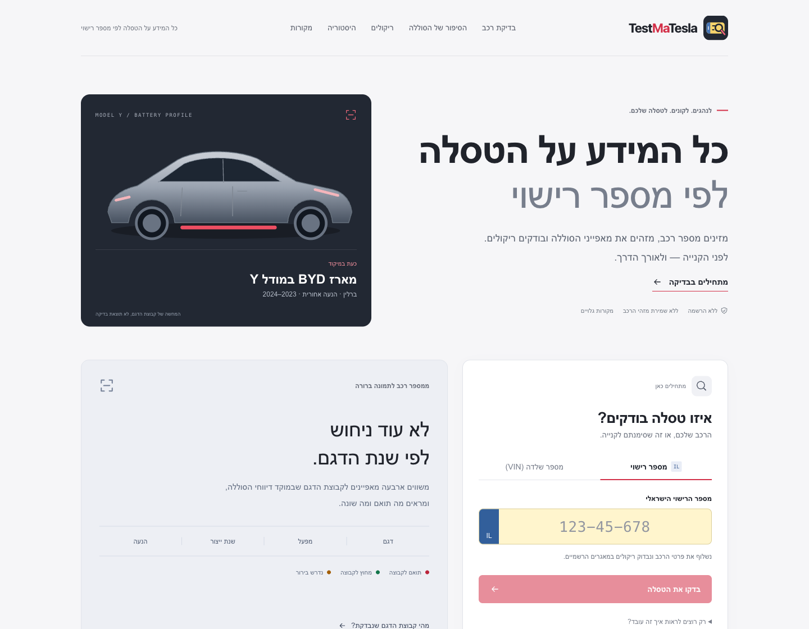

# TestMaTesla

**כל המידע על הטסלה לפי מספר רישוי**

A Hebrew-first vehicle-information site for Tesla owners and buyers in Israel.
Start with a license plate or VIN to understand the battery configuration, check
Israeli recalls, explore available ownership and mileage records, and share a
vehicle report.

**[Open TestMaTesla](https://testmatesla.com/)** |
[Report an issue](https://github.com/nakashon/testmatesla/issues) |
[Run locally](#run-locally)

[](https://github.com/nakashon/testmatesla/actions/workflows/deploy.yml)

[](https://testmatesla.com/)

## What you can do

| Feature | What you get |
|---|---|
| **Battery configuration** | A four-characteristic comparison with the reported Berlin Model Y RWD group, showing matches, differences and missing evidence. |
| **Israeli recall lookup** | Open recall records from the Ministry of Transport, with query time and source-update information. |
| **Ownership history** | A chronological view of published ownership dates and types, alongside current registration details. |
| **Recorded mileage** | The latest official inspection odometer reading and available registration-change indicators. |
| **Battery-document guidance** | Where to look for a CoC, how to request it from Tesla or the importer, and which code to enter. |
| **Shareable reports** | A downloadable Hebrew image, QR code and share link without the plate or the VIN's unique serial suffix. |

The interface is **Hebrew, right-to-left and mobile-friendly**. No account or Tesla
credentials are needed.

## Start with a plate. Go deeper when needed.

1. **Enter an Israeli license plate** to retrieve the vehicle's registration,
   recalls and available history. A VIN-only check works locally, without querying
   the government datasets.
2. **Read the battery result.** See exactly which characteristics match, rather
   than an unexplained score.
3. **Add evidence if you have it.** An exact CoC variant and known battery
   replacement history refine the result. Both are optional.
4. **Generate a report** to share with a seller, buyer or fellow owner.

There are built-in fictional examples for exploring the different outcomes
without looking up a real vehicle.

## Battery focus: evidence, not guesses

The current research centers on reported structural battery-pack failures in
**Berlin-built Model Y RWD vehicles, mainly from 2023-2024**, associated with the
BYD LFP configuration.

The checker compares **model, factory, year and drivetrain**. A result such as
**3 of 4 characteristics match** is a count, not a 75% failure probability.

| Result color | Meaning |
|---|---|
| **Red** | The known characteristics match the reported configuration; identify the installed pack next. |
| **Green** | At least one known characteristic differs from the specific profile being checked. |
| **Amber** | Information is missing or conflicting, or the configuration is outside the established decoding scope. |

**A configuration match is not a diagnosis. A non-match is not a safety
certificate.** Original build configuration, the currently installed battery and
a documented defect are separate questions.

The Israeli registry's production year is authoritative whenever available,
including in profile counts, shared pages and report images. The VIN year is a
fallback only when the registry year is missing; a difference does not trigger
a warning or conflict. First-registration date remains a separate field.
**2024 is the end of the main research window, not a
verified defective-batch cutoff.**

Manufacturer documentation, homologation reporting and owner-submitted reports
are distinguished in the site's source list. Research basis last updated:
**2026-09-12**. See [the source definitions](src/lib/checker.ts).

## What the data covers

The site queries the official Israeli datasets directly from the browser.
Battery assessment, recalls, ownership and mileage have independent results;
an unavailable source does not erase information from the others.

- **Recalls:** an empty response means no open records were found in that dataset,
  not that the vehicle has no faults or service actions elsewhere.
- **Ownership:** dates and ownership types, not owners' identities. Record counts
  are not presented as an authoritative previous-owner or Israeli "hand" count.
- **Mileage:** the latest inspection's cumulative reading, **not a year-by-year
  mileage archive**. Missing readings are not displayed as zero.
- **Coverage:** active-vehicle coverage can omit inactive or newly registered
  vehicles. The private-vehicle history datasets cover active vehicles from 2017;
  the ownership feed excludes vehicles that previously had another plate number.

The mileage source does not include the reading's date. The last-inspection date
from the active registry is therefore labeled separately, not used to manufacture
a historical mileage series. Registration-change flags are not accident reports.

## Sharing and privacy

Reports are generated locally. Their links contain a compact snapshot in the
**URL fragment**, which is not sent in the HTTP request to GitHub Pages.

| Included in a shared report | Not included |
|---|---|
| First 11 VIN characters describing the vehicle configuration | Full VIN or its six-digit serial suffix |
| CoC/replacement answers and available registration year/drivetrain | License plate or owner identity |
| Report creation time and optional recall-count snapshot | Ownership timeline, mileage history or service documents |

Shared reports are **unsigned user-generated summaries**, not live registry
responses or Tesla-issued certificates. The recipient can start their own lookup.

**Blue battery updates** distinguish a reported replacement or a documented
different installed pack from the original red/green model-profile result, in
both the page and PNG. Owners can state the evidence category (Tesla confirmation,
service document, or an identified pack part number); only that category is
shared, not the document. The site does not authenticate the evidence or label
a replacement as a proven repair. Original profile counts and conflicts remain
visible. An unfamiliar CoC code alone does not trigger blue.

The separate CoC request letter for Tesla is prefilled with the full VIN and,
when available, the registration number from the current lookup. It is only
copied on request, never sent automatically, and is intended for private contact
with Tesla or the importer rather than public sharing. Demo letters retain a
VIN placeholder; shared reports do not expose this letter.

The application has no backend, analytics or identifier storage. Plate lookups go
directly to `data.gov.il`, which receives the requested plate and visitor IP.
Requests omit credentials and referrers and disable browser caching. GitHub Pages
may retain ordinary hosting access logs. No external fonts or QR-generation
services are used.

## Branding and link previews

The original plate-and-magnifier mark is shared by the header, footer, favicon
and generated vehicle reports. WhatsApp, Facebook, LinkedIn and other Open Graph
consumers receive a static **1200 × 630 PNG**; X/Twitter receives large-image card
metadata. All preview URLs are absolute HTTPS URLs in the initial HTML, so
crawlers do not need to run React.

The preview is deliberately generic: report fragments never reach the server,
so a link preview cannot display the private report's vehicle-specific result.
The downloadable report image retains that result.

The editable preview source is [docs/branding/social-preview.html](docs/branding/social-preview.html).
With `npm run dev`, open `/docs/branding/social-preview.html` and capture
`#social-preview`, `#touch-icon` and `#favicon` at their native CSS dimensions
to regenerate the PNGs in `public/`. Keep the preview image filename and
`index.html` metadata in sync; version the filename when replacing the image.
Sharing services may cache an older preview even after deployment.

## Run locally

Requires **Node.js 24.13+** and npm.

```sh
git clone https://github.com/nakashon/testmatesla.git
cd testmatesla
npm ci
npm run dev
```

Open **http://127.0.0.1:5173**. No API keys or environment file are required.

| Command | Purpose |
|---|---|
| `npm test` | Run the existing Node test suite |
| `npm run build` | Type-check and build the static site |
| `npm run lint` | Run Oxlint |
| `npm run preview` | Serve the production build, normally on port 4173 |

## How it is built

**React + TypeScript + Vite**, deployed through **GitHub Actions to GitHub Pages**.
QR codes and report images are produced in the browser.

| Location | Responsibility |
|---|---|
| [`src/App.tsx`](src/App.tsx) | Lookup orchestration, page layout and shared-report navigation |
| [`src/components/`](src/components/) | Hebrew results, history, document guidance and sharing UI |
| [`src/lib/checker.ts`](src/lib/checker.ts) | VIN decoding, evidence reconciliation and profile assessment |
| [`src/lib/govil.ts`](src/lib/govil.ts) | Plate lookup and shared government API transport |
| [`src/lib/recalls.ts`](src/lib/recalls.ts), [`src/lib/history.ts`](src/lib/history.ts) | Source-specific validation, pagination and freshness |
| [`src/lib/share.ts`](src/lib/share.ts), [`src/lib/report-image.ts`](src/lib/report-image.ts) | Versioned report links and image rendering |
| [`tests/`](tests/) | Assessment, API and report-format coverage |

The government integration follows the same public resources and plate-to-VIN
mapping used in CarAgent, but this repository runs independently.

<details>
<summary><strong>Government API resources</strong></summary>

Endpoint: `https://data.gov.il/api/3/action/datastore_search`

| Dataset | Resource ID | Plate field |
|---|---|---|
| Active vehicles | `053cea08-09bc-40ec-8f7a-156f0677aff3` | `mispar_rechev` |
| Outstanding recalls | `36bf1404-0be4-49d2-82dc-2f1ead4a8b93` | `MISPAR_RECHEV` |
| Ownership history | `bb2355dc-9ec7-4f06-9c3f-3344672171da` | `mispar_rechev` |
| Latest inspection mileage | `56063a99-8a3e-4ff4-912e-5966c0279bad` | `mispar_rechev` |

Browser CORS support was observed on 2026-09-11/12. Network, CORS, timeout and
malformed-response failures are surfaced explicitly, never converted into empty
successful results. Pagination is bounded at 1,000 records with explicit partial
result handling. Changing vehicles cancels outstanding history requests.

Israeli model codes and registration directives are context, not an authenticated
code-to-battery-supplier mapping.

</details>

<details>
<summary><strong>Assessment and report contracts</strong></summary>

| Internal status | Rule |
|---|---|
| `candidate` | All four characteristics match, with no overriding conflict or unresolved CoC variant |
| `document-supported` | The profile matches and the user entered exact CoC variant `Y7CR` |
| `outside` | A known characteristic differs, without an overriding evidence conflict |
| `conflicting` | Factory, drivetrain or CoC evidence disagrees; differing VIN/registry years are not a conflict |
| `unknown` | Evidence or supported decoding is insufficient |

`probability` remains `null`: there is no representative labeled fleet dataset
with which to calibrate an individual probability. Complaint counts and profile
counts must not be converted into failure rates.

Historical VIN drivetrain decoding is scoped to the inspected Model Y generation.
Generic `LONG RANGE` trim is not treated as AWD across generations. Berlin E/F
characters are not used as a battery-supplier decoder. Format-valid VINs do not
prove vehicle existence or authenticity.

CoC evidence describes the original configuration. Exact `Y7CR` must come from
the document, not be guessed from an Israeli model code. Tesla's UK guidance
supports requesting a CoC; Israeli availability and fees remain subject to Tesla
or importer confirmation. Component-level EU declarations are not vehicle CoCs.
The site neither requests documents on an owner's behalf nor accepts Tesla
credentials.

Version 3 report links preserve the battery evidence category as well as available
registration year/drive evidence. Version 1 and 2 links remain readable; older
clients reject version 3 rather than silently dropping its evidence. Report
parsing validates identifiers, enums, dates, recall counts and contradictory
replacement/document answers. Fictional examples cannot generate shareable reports.

</details>

## Deployment

Pushes to `main` run the [deployment workflow](.github/workflows/deploy.yml),
which installs dependencies, runs the tests, builds the site and publishes it.
Manual deployment is also available through GitHub Actions.

The current live address is **https://testmatesla.com/**, configured as the GitHub
Pages custom domain. Relative application assets also support repository paths;
canonical and social-preview URLs point to the public custom domain.

Configure custom domains in [the repository's Pages settings](https://github.com/nakashon/testmatesla/settings/pages)
and at the DNS provider. This Actions-based deployment does not require a `CNAME`
file. Follow [GitHub's custom-domain guidance](https://docs.github.com/en/pages/configuring-a-custom-domain-for-your-github-pages-site/managing-a-custom-domain-for-your-github-pages-site).

## Contributing

Improvements to Hebrew UX, accessibility and evidence-backed identification are
welcome. For identification changes, include the source, its market/model/date
scope, and a regression case. Preserve unknown/conflicting states rather than
adding an unsupported supplier or safety verdict.

Use synthetic identifiers in examples and tests. **Do not post real plates, full
VINs, owner details or unredacted documents in public issues.**

---

TestMaTesla is an independent project, not affiliated with Tesla, BYD or the
Israeli Ministry of Transport. Follow the vehicle's active alerts and professional
service guidance.
